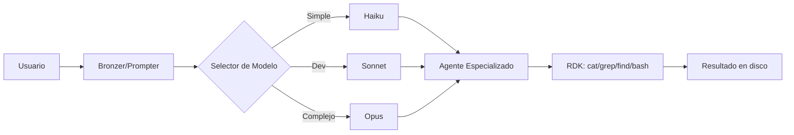
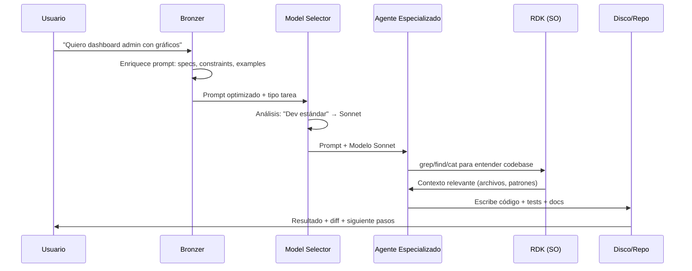

> [!info] 🎓 Ficha técnica
> **Instructor:** Carlos Gómez Pintado "el coletas"
> **Fecha:** 20/07/2026
> **Módulo:** Desarrollo con IA · ByCode / DevOps · LLMs, Tokens, Claude Code, Arquitectura de Agentes
> **Ambiente:** Kali Linux · Claude Code · Fable 5 / Opus / Sonnet / Haiku · GitHub · Obsidian · Neo4j · PortSwigger
> **Participantes:** Chema, Asier, Mariana, Pablo, Oscar, Juan Carlos, Confil, Sira, John, Charchas, Manu, Álvaro, Miquel
> **Objetivo general:** Sesión **pivote** que conecta los cimientos teóricos de LLMs/tokens con la práctica real de Claude Code y arquitectura de agentes.

---

> [!tip] Cómo leer estos apuntes
> Sesión **pivote** que conecta los cimientos teóricos de LLMs/tokens con la práctica real de Claude Code y arquitectura de agentes. Cubre desde "qué es realmente una IA" (herramienta de decisión, no generadora) hasta arquitectura ACIENT, subagentes, workflows y Cloud Code con permisos peligrosos. Cierra con práctica real: dieta, Mercadona, Obsidian graph, PowerShell, webhooks, y preparación para SQLi la semana siguiente.

---

## ① IA / LLM €” Qué es realmente (y qué NO es)

### La definición que cambia todo

> **IA no genera, busca, conecta, une y expone.**
> €” Carlos Gómez Pintado

| Concepto Erróneo | Realidad Técnica |
|------------------|------------------|
| "La IA genera texto" | La IA **predice el siguiente token** basándose en probabilidades estadísticas entrenadas sobre corpus masivo |
| "La IA crea información" | La IA **conecta información existente** en su espacio latente, une conceptos y expone relaciones |
| "La IA piensa" | La IA **toma decisiones** (next token) basándose en contexto, pesos y arquitectura de atención |
| "La IA entiende" | La IA **procesa tokens** €” unidades numéricas que representan fragmentos de texto (palabras, subpalabras, caracteres) |

### Conceptos Fundamentales

| Concepto | Definición Práctica |
|----------|---------------------|
| **Contexto** | Ventana de tokens que el modelo "recuerda" en la conversación actual. Finita. Cuando se llena, se pierden los tokens más antiguos. |
| **Token** | Unidad mínima de procesamiento. ~0.75 palabras en inglés, ~1 token ≠ˆ 4 chars en español. GPT-4o: 128k contexto. Claude: 200k+. |
| **Prompt** | Instrucción + Contexto + Ejemplos (few-shot) que guían la predicción del modelo. **Prompt grande = prompt autoexplicativo = menos alucinaciones**. |
| **Markdown** | Lenguaje de marcado ligero. **Formato nativo de comunicación con LLMs**. Estructura semántica que el modelo entiende nativamente (headers, listas, código, tablas). |

> [!important] Prompt grande = mejor resultado
> "Los prompts grandes son prompts autoexplicativos. Un prompt autoexplicativo deja menos libertad a la IA para desviarse (se fuma menos porros). Cuando la IA se fuma pocos porros, está mucho más centrada en lo que queremos."

---

## ② Modelos €” Panorama Actual

| Proveedor | Modelos Principales | Fortaleza | Acceso |
|-----------|---------------------|-----------|--------|
| **OpenAI** | GPT-4o, GPT-4o-mini, o1-preview, o1-mini | Razonamiento (o1), multimodal nativo (4o), velocidad | API, ChatGPT, Copilot |
| **Anthropic** | Claude 3.5 Sonnet, Opus, Haiku | Razonamiento, ventanas 200k+, coding, análisis largo | API, Claude.ai, Claude Code |
| **Google** | Gemini 1.5 Pro/Flash, 2.0 | Ventana 2M tokens, multimodal nativo, búsqueda integrada | API, AI Studio, Vertex |
| **Microsoft** | Copilot (GPT-4o), Phi-3 (local) | Integración Office/GitHub/Windows, modelo local pequeño | Copilot, Azure AI |
| **Locales** | Llama 3.1 (8B/70B/405B), Phi-3, Gemma 2, Qwen2 | Privacidad, offline, costo 0, control total | Ollama, LM Studio, llama.cpp |

### Local vs Cloud €” La Realidad Técnica

| Factor | Cloud (API) | Local (Ollama/LM Studio) |
|--------|-------------|--------------------------|
| **Modelo** | 400B+ params (GPT-4o, Claude 3.5 Sonnet) | 8B-70B típicos (Llama 3.1 8B/70B) |
| **Entrenamiento** | Meses en clusters masivos (miles de H100) | Fine-tunes o quantizados de modelos base |
| **Contexto** | 128k-2M tokens | 4k-128k (depende VRAM/RAM) |
| **Razonamiento** | SoTA (o1, Sonnet 3.5) | Limitado (mejora con CoT prompting) |
| **Latencia** | Red (100ms-2s) | Local (50ms-5s según hardware) |
| **Privacidad** | Datos salen de tu máquina | 100% local, cero telemetría |
| **Coste** | $/token o suscripción | Hardware (GPU VRAM 24GB+ para 70B) |

> [!warning] Realidad del local
> Un Llama 3.1 70B quantizado (4-bit) necesita ~40 GB VRAM/RAM. En CPU puro: 2-5 tok/s. En GPU 24GB: ~20-30 tok/s. **No compite con Sonnet 3.5 / GPT-4o en razonamiento complejo**. Sirve para: privacidad, offline, tareas simples, embedding, clasificación, drafting.

---

## ③ Interfaces €” Browser AI vs Cloud Code vs Cursor

| Interfaz | Modelo | Contexto | Herramientas | Ideal para |
|----------|--------|----------|--------------|------------|
| **ChatGPT / Claude.ai / Gemini** | Cloud | Chat session | Web search, code interpreter, canvas | Chat, análisis, investigación, one-shots |
| **Claude Code (CLI)** | Cloud (Sonnet/Opus/Haiku) | Proyecto completo (lee repo) | **RDK: cat, grep, find, bash, git, todo** | Dev real, refactor, arquitectura, agentes |
| **Cursor (IDE)** | Cloud + Local | Archivo actual + @codebase | Composer, Chat, Tab, Cmd+K | Coding asistido en IDE, inline edits |
| **Continue / Cline (VS Code)** | Local + Cloud | Workspace | Similar a Cursor | Open source, control total |

### Diferencia Clave: Cloud Code vs Cursor vs Browser

```
Browser AI (ChatGPT/Claude.ai):
 Usuario → Prompt → Modelo → Respuesta
 Contexto: Solo el chat actual
 Herramientas: Web search, code interpreter (aislado)

Cursor (IDE):
 Usuario → Prompt + @codebase → Modelo → Diff/Edit inline
 Contexto: Archivo actual + símbolos referenciados + @codebase
 Herramientas: LSP, git, terminal (limitado)

Claude Code (CLI + RDK):
 Usuario → Prompt → Agente (Bronzer → Especialista → Modelo) → 
 RDK: cat/grep/find/bash/git/todo → Filesystem real → Respuesta + cambios en disco
 Contexto: REPO COMPLETO (lee lo que necesita con RDK)
 Herramientas: SISTEMA OPERATIVO COMPLETO + Subagentes + Skills persistentes
```

> [!important] La diferencia no es el modelo, es el ENTORNO
> - **Browser**: Chat aislado, contexto efímero
> - **Cursor**: IDE-assisted, contexto por archivo/símbolo
> - **Claude Code + RDK**: Agente con acceso total al SO, subagentes especializados, skills persistentes en `claude.md`, auditoría de proyecto, cambio de cuenta sin perder contexto (AUDITORIA.md)

---

## ④ Skills, Workflows, Agentes €” Arquitectura ACIENT

### Skill (Habilidad)
> Un **prompt sistematizado + herramientas + reglas** que se carga en `claude.md` y se invoca como subagente. Persistente entre sesiones.

```markdown
# En claude.md
- Skill: design-researcher
 "Antes de crear cualquier interfaz, haz deep research sobre competidores del sector.
 Extrae patrones UX, colores, tipografía. Genera guía de estilos adaptada a ese nicho."
```

### Workflow (Flujo de Trabajo)
> **Secuencia orquestada de skills/agentes** que resuelve un problema completo end-to-end.



### Arquitectura ACIENT (Agentes, Contexto, Inferencia, Entorno, Nodos, Tokens)

| Componente | Función |
|------------|---------|
| **Agentes** | Subagentes especializados (Diseño, Bronzer, Selector, Research, Dev, Security, etc.) |
| **Contexto** | `claude.md` (persistente) + `AUDITORIA.md` (estado proyecto) + archivos leídos via RDK |
| **Inferencia** | Modelo seleccionado (Haiku/Sonnet/Opus) razona)Opera → Razonamiento → Acción |
| **Entorno** | SO real via RDK (bash, fs, git, gh, docker, kubectl, etc.) |
| **Nodos** | Conocimiento en Obsidian (grafo 2D) + Neo4j (red neuronal 3D + ontologías) |
| **Tokens** | Gestión inteligente: RDK (-80%), Model Selector, Context pruning |

> [!tip] Patrón Maestro: `Usuario → Bronzer → Agente Especializado → Modelo Adecuado`
> Cada capa filtra y mejora. El usuario escribe en lenguaje natural; el sistema se encarga de la ingeniería de prompts.

---

## ⑤ Práctica Real €” Comparativa de Modelos: Planificación de Dieta

### El Experimento
> Prompt idéntico a ChatGPT (GPT-4o), Claude (Sonnet 3.5), Gemini (1.5 Pro), Copilot, y local (Llama 3.1 70B):
> *"Diseña una dieta de 2000 kcal, 150g proteína, 30% grasa, resto carbohidratos. 5 comidas. Preferencias: pollo, arroz, verduras, huevos, avena. Dame tabla nutricional, lista compra semanal con cantidades, y coste estimado en Mercadona."*

### Resultados Comparativos

| Modelo | Calidad Nutricional | Lista Compra | Coste Mercadona | Formato | Tiempo |
|--------|---------------------|--------------|-----------------|---------|--------|
| **Claude Sonnet 3.5** | ⭐⭐⭐⭐⭐ Preciso macros, variado | ✓ Cantidades exactas por día/semana | ✓ Precios 2024 realistas | Markdown tablas + JSON | ~15s |
| **GPT-4o** | ⭐⭐⭐⭐ Bien, algo repetitivo | ✓ Buena | │š ⚠ Precios genéricos | Markdown | ~12s |
| **Gemini 1.5 Pro** | ⭐⭐⭐ Correcto | │š ⚠ Faltan algunas cantidades | ”Œ No precios | Markdown | ~20s |
| **Copilot (GPT-4o)** | ⭐⭐⭐ Similar a GPT-4o | ✓ | │š ⚠ | Markdown | ~15s |
| **Llama 3.1 70B (local)** | ⭐⭐ Básico, errores en macros | ”Œ Incompleta | ”Œ | Texto plano | ~45s (CPU) |

> [!important] Conclusión Práctica
> **Sonnet 3.5 gana en tareas estructuradas con constraints numéricos y formato de salida complejo.** Para coding: Sonnet/Opus. Para búsqueda rápida: Haiku/Gemini Flash. Local: solo privacidad/offline/drafting.

---

## ⑥ Acceso Web Real €” Estimación Precios Mercadona

### Técnica: Web Search + Estructuración

```markdown
PROMPT:
"Busca en web los precios actuales de Mercadona (web oficial o comparadores) para:
- Pollo fresco kg, Arroz redondo kg, Huevos L docena, Avena copos kg,
 Brócoli kg, Zanahoria kg, Patata kg, Aceite oliva virgen extra L
Devuelve: tabla producto | precio | unidad | fuente (URL) | fecha consulta
Calcula coste semanal de la dieta anterior."
```

### Resultado Tipo (Ejemplo Real)

| Producto | Precio | Unidad | Coste Semanal (dieta 2000 kcal) |
|----------|--------|--------|----------------------------------|
| Pollo fresco | 6,95 € | kg | 1.2 kg = 8,34 € |
| Arroz redondo | 1,15 € | kg | 0.7 kg = 0,81 € |
| Huevos L | 2,45 € | docena | 1.5 docenas = 3,68 € |
| Avena copos | 1,85 € | kg | 0.35 kg = 0,65 € |
| Brócoli | 1,95 € | kg | 0.7 kg = 1,37 € |
| Zanahoria | 0,85 € | kg | 0.5 kg = 0,43 € |
| Patata | 0,65 € | kg | 1 kg = 0,65 € |
| AOVE | 8,95 € | L | 0.15 L = 1,34 € |
| **TOTAL SEMANAL** | | | **≠ˆ 17,27 €** |

> [!tip] Web Access en Claude Code
> `claude "busca precios mercadona..."` usa **web search tool** nativo. En local: necesita `serpapi` o `brave-search` MCP server.

---

## ⑦ Gestión de Contexto €” Chats Separados por Tema

### El Problema
> Contexto finito = tokens. Mezclar temas = contaminación semántica = alucinaciones cruzadas.

### Solución: Arquitectura de Chats Temáticos

```
claude-code/
│”œ── .claude/
│ │”œ── chats/
│ │ │”œ── 01-architecture/ # Decisiones arquitectura, ADRs
│ │ │”œ── 02-frontend/ # Componentes, UI, CSS, estado
│ │ │”œ── 03-backend/ # API, DB, auth, workers
│ │ │”œ── 04-devops/ # CI/CD, infra, deploy, secrets
│ │ │”œ── 05-research/ # Deep research, competidores, tech radar
│ │ ┘── 06-meta/ # claude.md, AUDITORIA.md, skills, agentes
│ ┘── claude.md # System prompt global + skills + subagentes
```

### Flujo de Cambio de Contexto

```bash
# 1. En chat actual - auditoría
claude "hazme auditoría completa del proyecto" # → AUDITORIA.md

# 2. Cambias de chat/tema/herramienta
# 3. En nuevo contexto
claude "revisa AUDITORIA.md ¿en qué punto estamos? ¿qué sigue?"
```

> [!important] Regla de Oro
> **Un chat = un contexto semántico coherente.** No mezcles frontend + backend + arquitectura + research en el mismo hilo. Usa `AUDITORIA.md` como puente entre contextos.

---

## ⑧ Generación de Código €” Casos Reales

### PowerShell Script €” Automatización Windows

```powershell
# Prompt: "Script PowerShell que monitorice una carpeta, detecte nuevos CSV,
# los procese (normalize headers, valide filas), y mueva a procesados/errores.
# Log rotativo. Servicio Windows opcional."

# Resultado: FileSystemWatcher + CSV parsing robusto + Try/Catch + EventLog + 
# Config JSON + Install-Service.ps1 / Uninstall-Service.ps1
```

### Webhook Receiver + JSON Processing

```python
# Prompt: "FastAPI endpoint que reciba webhook de Stripe (checkout.session.completed),
# valide signature, extraiga metadata, guarde en PostgreSQL, publique evento en RabbitMQ.
# Idempotencia por event_id. Retry con backoff exponencial. Tests pytest."

# Resultado: main.py + models.py + webhook_handler.py + db.py + queue.py + 
# test_webhook.py + docker-compose.yml + .env.example
```

### Fixing Errors €” Depuración Asistida

```bash
# Error real: "TypeError: Cannot read property 'map' of undefined" en React
# Prompt: "Lee el error, el componente y el hook. Arregla."

# Claude Code:
# 1. grep -r "Cannot read property 'map'" src/
# 2. cat src/components/UserList.jsx
# 3. cat src/hooks/useUsers.js
# 4. Diagnóstico: useUsers devuelve null inicial, no []
# 5. Fix: useUsers → return [] por defecto + optional chaining en JSX
```

---

## ⑨ Obsidian Graph €” Importación CSV, Nodos, Correlaciones

### Pipeline: CSV → Obsidian → Grafo → Neo4j

```bash
# 1. Exportar datos (ej. base de datos vulnerabilidades, contactos, papers)
# 2. Script Python → Markdown frontmatter + wikilinks
python csv_to_obsidian.py vulns.csv --output vault/vulns/

# 3. Frontmatter generado:
---
title: "CVE-2024-1234"
tags: [sqli, critical, authenticated]
cvss: 9.8
cwe: [CWE-89]
affects: [[WordPress]], [[WP-Plugin-Contact-Form]]
references: ["https://nvd.nist.gov/vuln/detail/CVE-2024-1234"]
---

# CVE-2024-1234
SQL Injection en Contact Form 7 < 5.9...
```

### Correlaciones en Grafo (Obsidian Graph View)

```
Nodos: CVE, CWE, Componente, Versión, Exploit, Paper, Herramienta
Edges: 
 - CVE -[exploita]-> CWE
 - CVE -[afecta]-> Componente@Versión
 - Componente -[usa]-> Herramienta
 - Paper -[analiza]-> CVE
 - Exploit -[para]-> CVE
```

### Paso a Neo4j (Red Neuronal + Ontologías)

```cypher
// Nodos con propiedades semánticas
CREATE (cve:CVE {id: "CVE-2024-1234", cvss: 9.8, type: "SQLi"})
CREATE (cwe:CWE {id: "CWE-89", name: "SQL Injection"})
CREATE (comp:Component {name: "Contact Form 7", version: "<5.9"})

// Ontologías = relaciones en lenguaje natural
CREATE (cve)-[:EXPLOTA {confidence: 0.98, method: "UNION SELECT"}]->(cwe)
CREATE (cve)-[:AFECTA {vector: "POST /wp-admin/admin-ajax.php", param: "action"}]->(comp)
CREATE (comp)-[:USA {purpose: "formulario contacto"}]->(tool:Tool {name: "WordPress"})
```

> [!important] Diferencia clave
> - **Obsidian (Grafo 2D):** Índices + hipervínculos vacíos. "A enlaza a B". Sin semántica.
> - **Neo4j + Ontologías (Red 3D):** Relaciones semánticas. "CVE **explota mediante** UNION SELECT **la debilidad** CWE-89". **Permite inferencia**: si A explota B y B es tipo C, entonces A explota tipo C.

---

## ⑩ Arquitectura de Agentes €” Método ACIENT

### Subagentes Definidos en `claude.md`

| Subagente | Rol | Invocación |
|-----------|-----|------------|
| **Bronzer / Prompter** | Optimiza prompt usuario → prompt estructurado para agente final | Automático (primer paso) |
| **Model Selector** | Analiza tarea → elige Haiku/Sonnet/Opus | Automático (segundo paso) |
| **Design Researcher** | Deep research competidores → guía estilos nicho | `@design "e-commerce fitness"` |
| **Security Auditor** | Revisa código → OWASP Top 10, secrets, crypto, auth | `@security "auth module"` |
| **Dev Specialist** | Implementa feature/refactor/tests/docs | `@dev "user dashboard"` |
| **Research Agent** | Deep research técnico/web → síntesis + fuentes | `@research "eBPF security"` |
| **Architecture Agent** | ADRs, diagramas, decisiones infra, threat modeling | `@arch "microservices vs modular monolith"` |

### Workflow Completo (Ejemplo: Nueva Feature)



---

## ⑪ Cloud Code €” Permisos Peligrosos, Skip, Auto-test

### Modo YOLO (--dangerously-skip-permissions)

```bash
# │š ⚠ PELIGROSO - Solo en entornos controlados / contenedores desechables
claude --dangerously-skip-permissions

# Qué salta:
# - Confirmaciones de bash (rm, chmod, git push, docker, kubectl)
# - Escritura en archivos fuera del proyecto
# - Comandos de red (curl, wget, ssh, scp)
# - Gestión de procesos (kill, systemctl)
# - Instalación paquetes (npm, pip, apt, cargo)
```

> [!warning] Nunca en producción ni máquinas compartidas
> Usa contenedor efímero: `docker run -it --rm -v $(pwd):/workspace claude-code:latest`

### Auto-test Loop (Desarrollo Dirigido por Tests)

```bash
# Prompt en claude.md o chat:
"Cuando escribas código, SIEMPRE:
1. Escribe test primero (TDD) o junto al código
2. Ejecuta: pytest / npm test / go test ./...
3. Si falla: arregla y repite hasta verde
4. Si pasa: commit con mensaje convencional"
```

### Configuración `claude.md` para Cloud Code

```markdown
# === CLAUDE.MD - CONFIGURACIÓN PERSISTENTE ===

# Model Selector
- Haiku: búsquedas, grep, cat, clasificación, ops simples
- Sonnet: desarrollo estándar, refactor, features, tests
- Opus: SOLO razonamiento complejo, arquitectura, debugging profundo, security audit

# RDK (Research Development Kit) - OBLIGATORIO
- Usa SIEMPRE cat/grep/find/bash/git del SO para file ops
- NO uses herramientas internas de lectura/escritura masiva
- Ahorra ~80% tokens

# Subagentes (Skills)
- design-researcher: deep research competidores → style guide
- bronzer: usuario → prompt optimizado → agente final
- model-selector: tarea → Haiku/Sonnet/Opus
- security-auditor: OWASP, secrets, crypto, authz
- arch-agent: ADRs, threat modeling, infra decisions

# Reglas Inmutables
- TDD obligatorio: test → code → test pass → commit
- Convencional commits: feat/fix/refactor/docs/test/chore
- Un archivo = una responsabilidad (SRP)
- Documenta decisiones en ADR/ARCHITECTURA.md
- AUDITORIA.md actualizada tras cada sesión significativa
```

---

## ⑫ Frase Clave de la Sesión

> **"IA no genera, busca, conecta, une y expone."**
> €” Carlos Gómez Pintado

> **Significado:** El valor no está en "generar código/texto", sino en **conectar información dispersa**, **unir conceptos** que el humano tiene en la cabeza pero no ha estructurado, y **exponer** la solución óptima dado el contexto, constraints y criterio de negocio.

---

## ⑬ Próxima Sesión €” ByCode / DevOps + SQL Injection

| Tema | Enfoque |
|------|---------|
| **ByCode / DevOps** | Despliegue real en servidores, GitHub Actions, arquitectura segura, Claude Code en infra propia |
| **SQL Injection** | Misma estructura progresiva: básico → UNION → Blind → Time-based → OOB (DNS/OOB) |
| **Práctica** | PortSwigger Labs SQLi + máquina propia integrando todo el bloque web |

> [!tip] Preparación
> - Repasar: UNION SELECT, information_schema, blind boolean/time, sqlmap esenciales
> - PortSwigger: SQLi labs (todos los niveles)
> - Llevar máquina Kali lista con Burp + sqlmap + PostgreSQL/MySQL clients

---

## ⑭ Checklist de Repaso €” IA, LLMs, Claude Code, Agentes

```
[ ] Explicar a un junior: "¿Qué es un token y por qué importa el contexto?"
[ ] Diferenciar: Browser AI vs Cursor vs Claude Code (entorno, herramientas, contexto)
[ ] Configurar Claude Code: install, --dangerously-skip-permissions, RDK, claude.md
[ ] Definir 3 subagentes útiles para tu stack (ej: design, security, devops)
[ ] Escribir prompt grande autoexplicativo para tarea compleja (MVP, auditoría, research)
[ ] Probar web search real: precios supermercado, docs técnicas, CVE recientes
[ ] Separar chats por tema: architecture / frontend / backend / devops / research
[ ] Generar código real: script PS1, webhook FastAPI, fix bug React
[ ] Pipeline CSV → Obsidian MD → Graph View → Neo4j Cypher
[ ] Explicar ACIENT: Agentes, Contexto, Inferencia, Entorno, Nodos, Tokens
[ ] Entender: Local (Llama) vs Cloud (Sonnet/Opus) €” cuándo cada uno
[ ] Configurar auto-test loop en claude.md (TDD obligatorio)
[ ] Frase clave: "IA no genera, busca, conecta, une y expone"
```

---

> [!important] Notas de Clase
> - Sesión impartida por **Carlos Gómez Pintado** €” módulo ByCode/DevOps, transición hacking web → desarrollo con IA.
> - Participación activa: **Chema** (Claude Code setup en directo), **Asier** (Obsidian vs red neuronal), **Mariana** (app neurodivergencias, sesgos, biométricos), **John** (caso finanzas personales MVP).
> - Casos reales mostrados: e-commerce 4.000€ en 3 prompts, gemelo digital felino (clínica veterinaria), red neuronal por niño + red superior correlaciones.
> - Configuración práctica completa: `claude.md` con model selector, RDK, subagentes, skills persistentes.
> - Próximo bloque: **ByCode/DevOps (despliegue real, GitHub Actions, servidores, arquitectura segura)** + **SQL Injection progresiva**.
> - **Septiembre:** Blue Team con Edu, Active Directory, Escalada de Privilegios dedicado.

---

> [!quote] 💬 Frase Clave de la Sesión
> "El valor ya no está en programar, sino en **saber qué construir, cómo estructurarlo y cómo venderlo**. La IA ha bajado el coste de un MVP de semanas a horas. El diferencial es el **criterio de negocio**, no la sintaxis.€” Carlos Gómez Pintado"
> — Carlos Gómez Pintado
---

## Notas de clase

- Clase impartida por el instructor.
- Participación activa de los alumnos.

---

## Checklist de repaso

- [ ] IA / LLM €” Qué es realmente (y qué NO es)
- [ ] Modelos €” Panorama Actual
- [ ] Interfaces €” Browser AI vs Cloud Code vs Cursor
- [ ] Skills, Workflows, Agentes €” Arquitectura ACIENT
- [ ] Práctica Real €” Comparativa de Modelos: Planificación de Dieta
- [ ] Acceso Web Real €” Estimación Precios Mercadona
- [ ] Gestión de Contexto €” Chats Separados por Tema
- [ ] Generación de Código €” Casos Reales

---

## Red de Conocimiento

- [[../apuntes Joselu/MODULO1/resumen_master_clase5.md]]
- [[../apuntes evolve/BLOQUE 2.md]]
- [[../apuntes Joselu/MODULO1/resumen_master_clase2.md]]
- [[15.07.2026 IA Introducción y Vibe Coding.md]]
- [[../apuntes Joselu/PREWORK/resumen_clase15.md]]
- [[../transcripciones/Julio/23.07.2026 IA De los cimientos a la Cima- LLMs, Tokens, Claude Code y Arquitectura de Agentes.md]]

---

## Tags

```
#blue-team #burpsuite #escalada-privilegios #ia #kali #linux #redes #sqli #sqlmap #windows
```


---

## 🔗 Red de Conocimiento

### Documentos Relacionados

- [[04.09.2026 OWASP API Top 10 Labs.md|04.09.2026 OWASP API Top 10 Labs]] — IA en Ciberseguridad, Linux, Windows
- [[15.07.2026 IA Introducción y Vibe Coding.md|15.07.2026 IA Introducción y Vibe Coding]] — IA en Ciberseguridad, Linux, SQLMap
- [[../transcripciones/Septiembre/07.09.2026 SQLi - Fundamentos de SQL.md|07.09.2026 SQLi - Fundamentos de SQL]] — IA en Ciberseguridad, Linux, Windows
- [[../apuntes Joselu/PREWORK/resumen_clase15.md|resumen_clase15]] — IA en Ciberseguridad, Linux, Windows
- [[../transcripciones/Julio/23.07.2026 IA De los cimientos a la Cima- LLMs, Tokens, Claude Code y Arquitectura de Agentes.md|23.07.2026 IA De los cimientos a la Cima- LLMs, Tokens, Claude Code y Arquitectura de Agentes]] — IA en Ciberseguridad, Linux, Windows
- [[../Apuntes/comandos/SQLMap.md|SQLMap]] — IA en Ciberseguridad, SQL Injection, SQLMap

### 🛠️ Herramientas

- [[comandos/BurpSuite|Burp Suite]]
- [[comandos/SQLMap|SQLMap]]

### 🎯 Vulnerabilidades Relacionadas

- [[Apuntes/05 - Auditoria Web/SQL Injection.md|SQL Injection]]

> #blue-team #burpsuite #escalada-privilegios #ia #kali #linux #redes #sqli #sqlmap #windows
